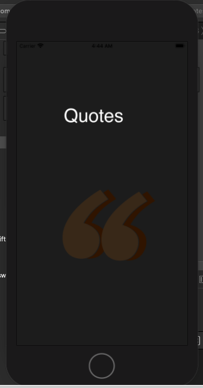
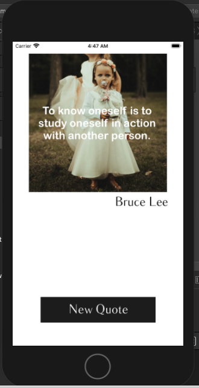
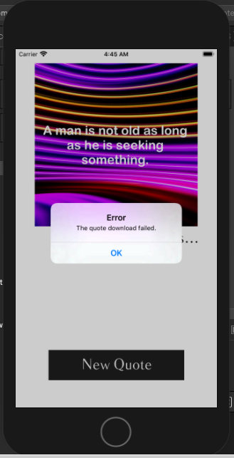

# Random-Quotes-IOS

Il s'agit d'une application IOS qui permet la communication avec 2 api differents, la premiere nous fournit aleatoirement
des citations connues, et la deuxieme met a notre disposition plusieurs photos chargees aussi aleatoirement, afin de 
les afficher aux utilisateurs et leurs donner le droit de charcher un seul citation a la fois pour eviter les conflits 
entre les requetes reseau.

<h3> Page de chargement </h3>

<h3> En cas de requette reussie dans erreur </h3>

<h3> En cas d'erreur </h3>

